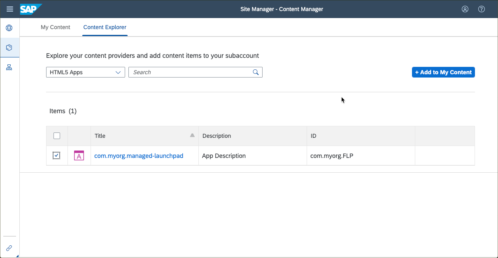

# SAP Fiori App with a Managed Application Router

## Diagram


## Description

This is an example of an SAP Fiori app that is accessed by a managed application router. The SAP Fiori app is exposed to the SAP Launchpad service and is visible in the content manager of the launchpad. The app is deployed to the HTML5 Application Repository via the Cloud Foundry environment  and uses the Authentication & Authorization service (XSUAA service) and the destination service. 

The web app that is contained in the `uimodule.zip` defines the following properties in the `manifest.json` file. Otherwise, the correspoding values in the `mta.yaml` descriptor need to be updated as well.

```JSON
{
  "sap.cloud": {
    "public": true,
    "service": "cloud.service"
  },
  "sap.app": {
    "id": "com.myorg.FLP",
    "applicationVersion": {
      "version": "1.0.0"
    }
  },
  "sap.ui5": {
    "dependencies": {
        "minUI5Version": "1.65.0"
    }
  }
}
```


### Optional CAP service with authorization
The SAP Fiori app consume the Northwind odata.org public service, to use instead a CAP service with required authentication look at [optional-self-hosted-backend](../optional-self-hosted-backend/)

## Download and Deployment
1. Subscribe to the [launchpad service](https://developers.sap.com/tutorials/cp-portal-cloud-foundry-getting-started.html) if you haven't done so before.
2. Download the source code:
    ```
    git clone https://github.com/SAP-samples/multi-cloud-html5-apps-samples
    cd multi-cloud-html5-apps-samples/managed-html5-runtime-fiori-mta
    ```
3. Build the project:
    ```
    npm install
    npm run build
    ```
4. Deploy the project:
    ```
    npm run deploy:cf
    ```
    or
    ```
    cf deploy mta_archives/managed_fiori_1.0.0.mtar
    ```
5. See the URL of the web app:
    ```
    cf html5-list -di managed-fiori-destination -u --runtime launchpad
    ```

> Use the following command in case you use the Portal service
>
>  `cf html5-list -di managed-fiori-destination -u --runtime cpp`


## Check the Result

### List the Deployed HTML5 Apps
```
$ cf html5-list -di managed-fiori-destination -u --runtime launchpad-u                               
Getting list of HTML5 applications in org 9f10ed8atrial / space dev as firstname.lastname@domain.com...
OK

name             version   app-host-id                            service name    destination name                  last changed                    url   
comsapfioriapp   1.0.0     145bd58f-4e2a-4b66-999f-2a03a4870d4e   cloud.service   managed-fiori-destination-html5   Tue, 16 Feb 2021 11:19:52 GMT   https://9f10ed8atrial.launchpad.cfapps.eu10.hana.ondemand.com/8579be75-0008-4835-abf4-5c8c82b46f5c.cloudservice.comsapfioriapp-1.0.0/   
```

> You need to substitute `cpp` with `launchpad`, in case you use the Launchpad service (instead of the Portal service).

### List the Deployed MTA

```
$ cf mta hello-world
Showing health and status for multi-target app hello-world in org 9f10ed8atrial / space dev as firstname.lastname@domain.com...
OK
Version: 1.0.0

Apps:
name   requested state   instances   memory   disk   urls   

Services:
name                                service           plan          bound apps   last operation   
managed_launchpad_destination       destination       lite                       update succeeded   
managed_launchpad_html5_repo_host   html5-apps-repo   app-host                   update succeeded   
managed_launchpad_uaa               xsuaa             application                update succeeded  
```


### List the Deployed Content with the Content Explorer




### Check the HTML5 App

Access the URL described in [Download and Deployment](#download-and-deployment) to view the web app. You are redirected to a sign-on page before you can see the web app.


