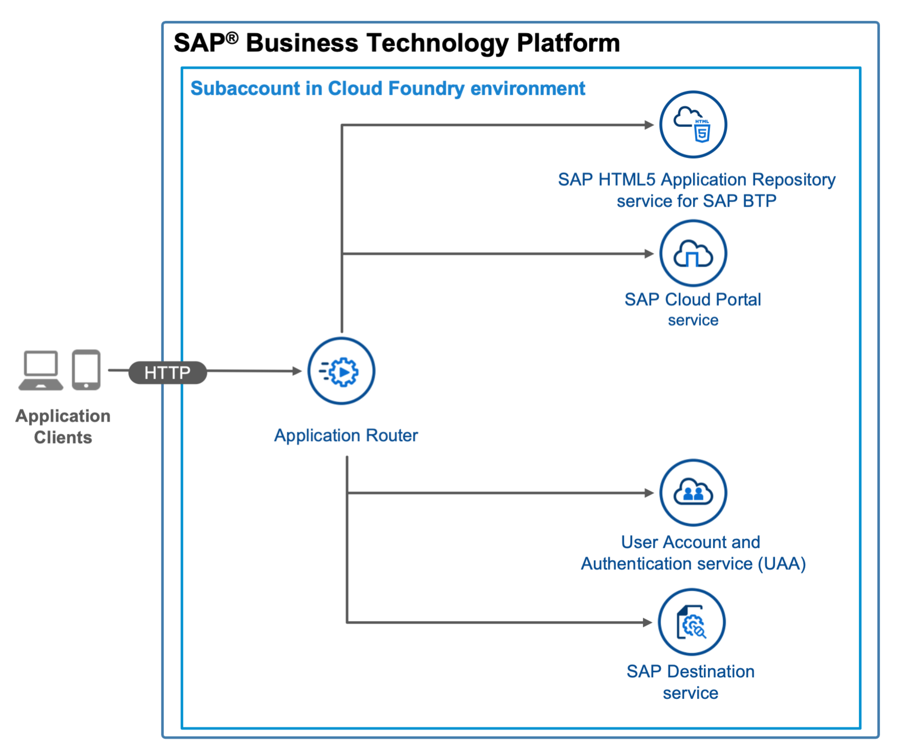
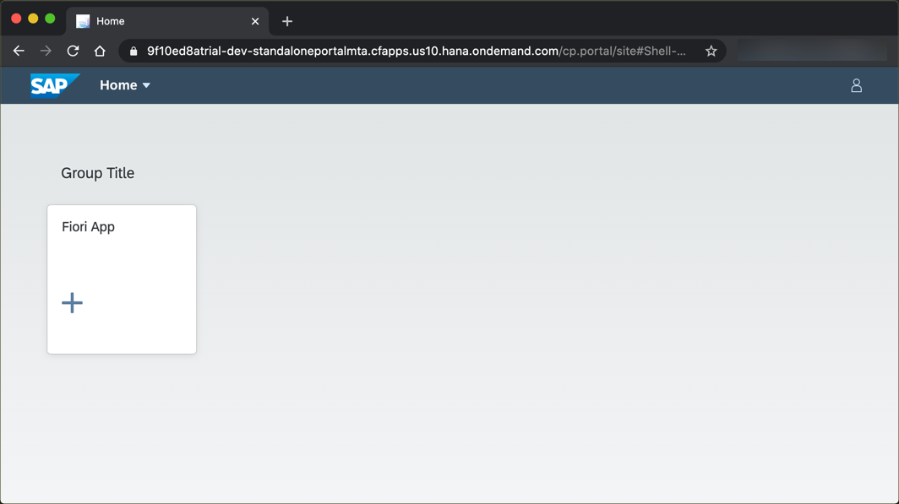

# On Standalone Application Router, with SAP Cloud Portal Integration

## Diagram



## Description

> Note: The service plan "portal-standard" [has been removed from the trial landscape](https://blogs.sap.com/2019/07/22/portal-service-available-on-sap-cloud-platform-cloud-foundry-trial-account/) and therefore this sample cannot be deployed to trial environments any longer. Please use a [free tier](https://developers.sap.com/group.btp-setup.html) or production environment as the target platform or explore the [SAP Fiori app with a managed application router](../managed-html5-runtime-fiori-mta). 

This is an example of an HTML5 app that you maintain on a standalone application router in your own space in the Cloud Foundry environment. The app is deployed to the HTML Application Repository. The app uses Authentication & Authorization service (XSUAA service), the destination service and the SAP Cloud Portal service, which means that the app can be integrated in an SAP Fiori Launchpad.


## Download and Installation
1. Download the source code:
    ```
    git clone https://github.com/SAP-samples/multi-cloud-html5-apps-samples
    cd multi-cloud-html5-apps-samples/standalone-approuter-portal-mta
    ```
2. Build the project:
    ```
    npm install
    npm run build
    ```
3. Deploy the project:
    ```
    cf deploy mta_archives/standalone-portal-mta_1.0.0.mtar
    ```

If the deployment has been successful, you find the URL of the application router in the console output or you can print it on Unix-based systems with `cf app standaloneportalmta | awk '/^routes/ { print "https://"$2"/" }'`.It probably has the following structure: <https://[globalaccount-id]-dev-multi-cloud-html5-apps-samples.cfapps.eu10.hana.ondemand.com>.


## Configuration

The `deployer/resources/uimodule.zip` archive contains a sample SAPUI5 web app and is already prepacked, so that it can easily be deployed.

You can replace the content of the archive with your own web app but keep in mind that you have to change the path to the default app if the web app has a different ID. This app ID also needs to be referenced in the `launchpad/portal-site/CommonDataModel.json` file. In case you want to know what happens in this sample, check out [this blog post](https://blogs.sap.com/2020/06/22/understanding-the-nuts-and-bolts-of-sap-fiori-development-for-cloud-foundry/).

To change the path to the default app, edit the `welcomeFile` property in the [`xs-app.json`](router/xs-app.json) configuration file of the application router.

## Check the Result

### List the Deployed HTML5 Apps
```
$ cf html5-list                                     
Getting list of HTML5 applications in org 9f10ed8atrial / space dev as firstname.lastname@domain.com...
OK

name                          version   app-host-id                            service instance                      visibility   last changed   
commyorgstandaloneportalmta   1.0.0     f97283a5-3f63-4398-af40-fe8220e0055b   standaloneportalmta_html5_repo_host   private      Mon, 10 Aug 2020 13:54:57 GMT  
```

### List the Deployed MTA

```
$ cf mta standalone-portal-mta
Showing health and status for multi-target app standalone-portal-mta in org 9f10ed8atrial / space dev as firstname.lastname@domain.com...
OK
Version: 1.0.0


Apps:
name                                     requested state   instances   memory   disk   urls   
standaloneportalmta_launchpad_deployer   stopped           0/1         256M     1G        
standaloneportalmta                      started           1/1         512M     512M   9f10ed8atrial-dev-standaloneportalmta.cfapps.us10.hana.ondemand.com   

Services:
name                                     service           plan          bound apps                                                    last operation   
standaloneportalmta_destination          destination       lite          standaloneportalmta                                           create succeeded   
standaloneportalmta_html5_repo_host      html5-apps-repo   app-host      standaloneportalmta_launchpad_deployer                        create succeeded   
standaloneportalmta_html5_repo_runtime   html5-apps-repo   app-runtime   standaloneportalmta                                           create succeeded   
standaloneportalmta_portal               portal            standard      standaloneportalmta_launchpad_deployer, standaloneportalmta   create succeeded   
standaloneportalmta_uaa                  xsuaa             application   standaloneportalmta_launchpad_deployer, standaloneportalmta   create succeeded   
```

### Check the Web App

Access the URL to view the web app. You are redirected to a sign-on page before you can see the web app.


